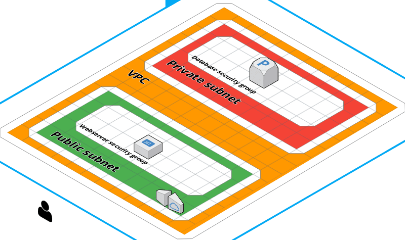

This is an evolving collection of examples around creating common AWS architectures with Terraform. 

## Example #1 - EC2 Instance running public Docker container

Demonstrates creating: 

* A VPC
* 2 subnets (public and private)
* An internet gateway
* A route table 
* A route table association 
* An ssh key pair 
* An EC2 instance
* A user data script that runs on instance startup to pull and run our Golang web service

[View the code here](./ec2-database)

